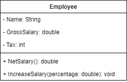

# Exercício 03 - Programação Orientada à Objetos
---
## Problema
Fazer um programa para ler os dados de um funcionário (nome, salário bruto e imposto).
Em seguida, mostrar os dados do funcionário (nome e salário líquido.)
Logo após, aumentar o salário do funcionário com base em uma porcentagem dada (somente o salário bruto é afetado pela porcentagem) e mostrar novamente os dados do funcionário.
Criar a classe abaixo:

### Diagrama UML Classe

---