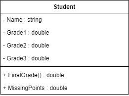

# Exercício 05 - Programação Orientada à Objetos
---
## Problema
Fazer um programa para ler o nome de um aluno e as três notas que ele obteve nos três trimestres do ano - primeiro trimestre vale 30 e, o segundo e o terceiro, valem 35 cada.
Ao final, mostrar qual a nota final do aluno no ano. Dizer também se o aluno está aprovado (Pass) ou não (Failed) e, em caso negativo, quantos pontos faltam para o aluno obter o mínimo para ser aprovado, que é 60% da nota.
Criar uma classe `Student` para resolver o problema.
### Diagrama UML de Classe

---