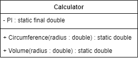

# Exercício 06 - Programação Orientada à Objetos

## Problema
Fazer um programa para ler um valor númerico qualquer e mostrar qual seria o valor de uma circunferência e do volume de uma esfera para um raio daquele valor.
Informar também o valor de $\pi$ com duas casas decimais.
Utilizar membros estáticos para resolver o problema.
### Diagrama UML de Classe

---
### Fórmulas matemáticas
#### Circunferência
```math
\text{C} = 2\pi\text{R}
```
#### Volume
```math
\text{V} = \frac{4}{3} \pi R^3
```
---
### Observação
- Na declaração de uma variável, ao atribuirmos o modificador `final`, estamos dizendo que ela passará a ser uma constante, ou seja, seu valor não mudará mais.
- Ao declarar uma constante, deve-se atribuir o valor no momento da declaração.
```
public static final double PI = 3.1415;
```