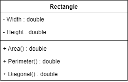

# Exercício 04 - Programação Orientada à Objetos
---
## Problema
Fazer um programa para ler os valores da largura e altura de um retângulo.
Em seguida, mostrar na tela o valor de sua área, perímetro e diagonal.
Usar a classe mostrada abaixo:

### Diagrama UML Classe

Inserir imagem.

### Fórmulas matemáticas
\text{area} = \text{width} \cdot \text{height}
\text{perimeter} = 2 \cdot (\text{width} + \text{height})
\text{diagonal} = \sqrt{(\text{width})^2 + (\text{height})^2}
